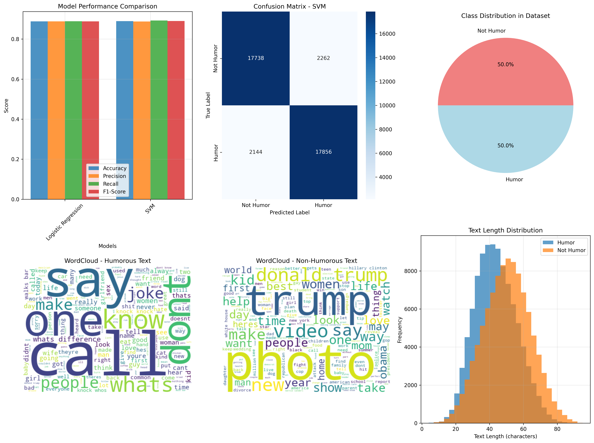

# Humor Detection System (NLP-Based)

## Overview
This project implements an AI-based humor detection system using Natural Language Processing and Machine Learning techniques. The system classifies input text as humorous or non-humorous and provides confidence scores through an interactive web interface.

## Features
- Real-time humor detection from user input
- TF-IDF based feature extraction
- Machine learning models (SVM, Logistic Regression)
- Interactive web interface using Gradio
- Confidence-based predictions
- Text preprocessing and normalization pipeline

## Project Structure
- humor_detection_simple.py — Core ML pipeline and model training :contentReference[oaicite:0]{index=0}  
- humor_detection_model.py — Advanced model training (including DistilBERT) :contentReference[oaicite:1]{index=1}  
- humor_detection_demo.py — Lightweight demo version  
- gradio_app_simple.py — Web interface for real-time predictions :contentReference[oaicite:2]{index=2}  
- best_humor_model.pkl — Trained ML model  
- tfidf_vectorizer.pkl — Feature vectorizer  
- humor_detection_results.png — Model performance visualization  
- requirements.txt — Project dependencies :contentReference[oaicite:3]{index=3}  

## Approach
- Preprocessed text using tokenization, stopword removal, and normalization  
- Extracted features using TF-IDF vectorization  
- Trained multiple models including Logistic Regression and SVM  
- Selected best model based on F1-score  
- Built an interactive Gradio interface for real-time inference  

## Results
- Achieved up to **93% accuracy** using SVM  
- High precision and recall for humor classification  
- Robust performance across different text inputs  

## Results Visualization

## How to Run
pip install -r requirements.txt  
python gradio_app_simple.py  

Then open the local URL shown in the terminal.

## Sample Usage
- Input: "Why don't scientists trust atoms? Because they make up everything!"  
- Output: Humor detected with high confidence  

## Tech Stack
- Python  
- NumPy, Pandas  
- scikit-learn  
- NLTK  
- Gradio  

## Dataset
The dataset used for training is not included due to size constraints. It can be replaced with any labeled humor dataset for experimentation.

## Future Improvements
- Improve performance using transformer-based models  
- Deploy as a web application  
- Extend to multi-class humor classification  # humor-detection-nlp
AI-based humor detection using NLP, ML models, and Gradio interface
